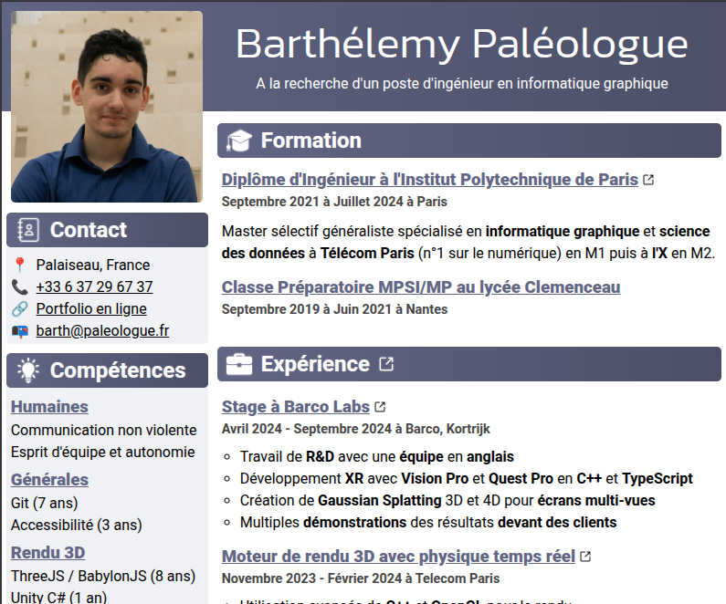

# Resume Website



This project is a Next.js application that renders a personal resume with support for French and English content. The resume content is stored as structured TypeScript modules so you can easily tailor the site to your own profile.

## Prerequisites

- Node.js 18 or newer (Next.js 13 requires an active LTS release)
- npm 9 or newer (bundled with recent Node.js releases)

## Installation

Clone the repository and install the dependencies:

```bash
npm install
```

## Running the app

### Development server

Start the development server with hot reloading:

```bash
npm run start
```

The application will be available at <http://localhost:3000/resume>. Changes to the source files trigger an automatic rebuild.

### Production build

Create an optimized production build:

```bash
npm run build
```

By default Next.js serves the production build with `next start`. If you prefer to host the statically exported output, you can run:

```bash
npm run serve:prod
```

This command serves the contents of the `out/` directory using `http-server`.

## Updating the resume content

All resume data lives under `src/app/resumeData/` and is organized by category:

- `you.ts`: name, phone, email, portfolio link, and location displayed in the header.
- `experiences.ts`: professional experiences and projects. Each entry includes a `title`, `url`, `when`, a bullet list in `what`, and an `enabled` flag. Set `enabled` to `false` to hide an item without deleting it.
- `formations.ts`: education history, structured similarly to experiences.
- `skills.ts`, `languages.ts`, and `hobbies.ts`: categorized lists for the corresponding sections.
- `settings.ts`: configuration flags such as `showPicture` to control optional UI elements.

The project supports both French and English strings. Text values are wrapped with the helper `S({ fr: "…", en: "…" })` defined in `src/app/internationalization.ts`. Provide translations for each language code to keep both locales synchronized.

Section headings and other interface labels are defined in `src/app/strings.ts`.

Static assets, including the profile picture and icons, live in `src/app` and `public/`. Replace these files if you need to swap imagery.

## Project structure

- `src/app/page.tsx`: entry point for the main resume page.
- `src/app/*Container.tsx`: React components that render each section of the resume.
- `src/app/styles/`: SCSS styles for layout and typography.

Refer to these files if you need to adjust layout, styling, or component logic beyond the data updates described above.
